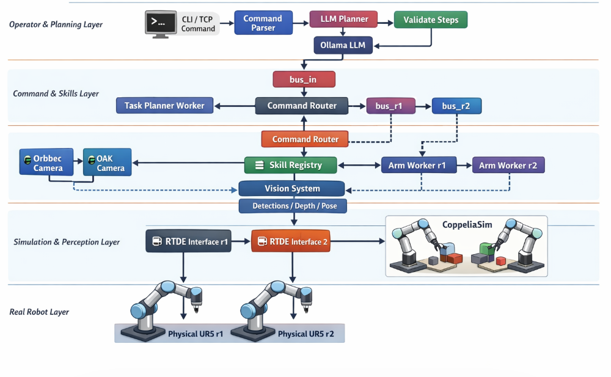
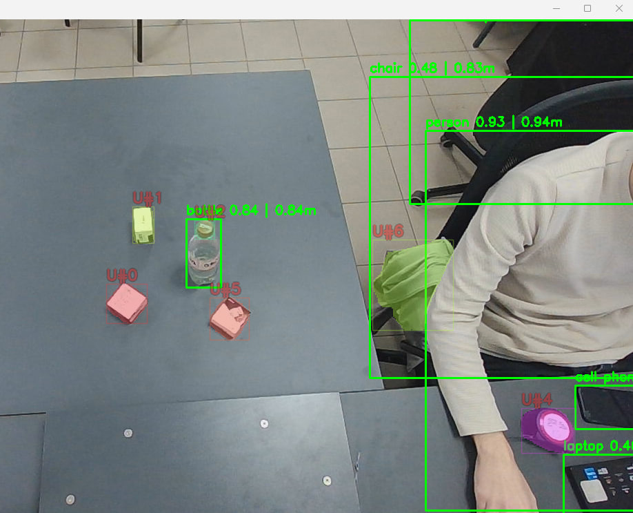
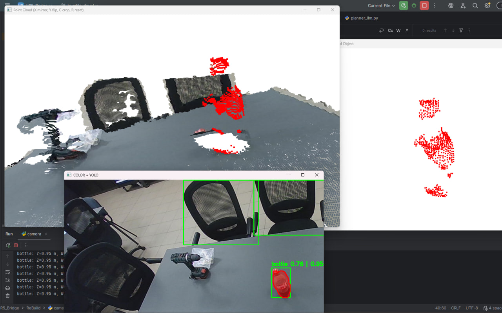
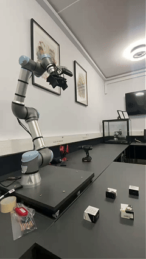

# Universal Sim-to-Real Manipulation for Dual UR5 Arms

> A dual-arm sim-to-real manipulation system designed to interact with **arbitrary real-world objects** — including objects the system has **never seen before** — regardless of where they are placed or how they are oriented.  
> If an object is **physically reachable**, the system aims to manipulate it by reconstructing the real scene in simulation and executing actions through synchronized virtual robot twins.

---

## Project Goal

The main goal of this project is to achieve **manipulation of arbitrary objects**, independent of whether the system has seen them before or is encountering them for the first time.

The central idea is simple:

- the system should not depend on a closed set of known objects
- it should not depend on fixed object placement
- it should not depend on predefined object orientation
- if an object is **physically reachable**, the system should be able to perform manipulation on it

This is achieved through a **sim-to-real manipulation concept**, where the real scene is reconstructed in simulation, actions are planned and executed there, and the real robotic arms follow their synchronized virtual counterparts.

---

## Core Idea

The project is built around the assumption that, in an unconstrained real environment, most objects are initially **unknown**:

- their exact pose is unknown
- their size may be unknown
- their geometry may be unknown
- their category may be unknown

What is known with the highest confidence are the robot arms themselves.

Because the real robot arms are synchronized with their virtual twins in simulation, they become the **starting reference point** from which the system reconstructs real objects and the surrounding environment inside the simulator.

In other words:

> the robot arms are the anchor between reality and simulation

Once the surrounding objects are reconstructed relative to the arms, the simulator becomes a reliable space for motion planning and skill execution.

---

## Four Main Pipelines

To reach this goal, the project is built around **four major pipelines** working together in parallel.

---

## 1. Arm Synchronization with Virtual Twins

The first and most fundamental pipeline is the synchronization of the real robot arms with their virtual counterparts in simulation.

This is critical because the only objects whose state is known in advance with high confidence are the robot arms themselves.  
For that reason, the arms serve as the initial reference frame for reconstructing the real world inside the simulator.

Each real arm has exactly **one synchronized virtual twin**:

- physical arm `r1` ↔ virtual arm `r1`
- physical arm `r2` ↔ virtual arm `r2`

The real arms continuously follow the motion of their virtual counterparts, while the simulator maintains the authoritative kinematic state. This creates a stable bridge between the real scene and the virtual environment.

This synchronization pipeline is the foundation on top of which all further reconstruction and manipulation is built.

### Why this matters

Without accurate real-to-virtual synchronization:

- object reconstruction would drift
- manipulation planning would not be trustworthy
- trajectories computed in simulation would not transfer reliably to hardware

By keeping the robot arms and their virtual twins aligned, the system gets a consistent geometric reference for everything else.

---

## 2. Machine Vision and Real-World Object Reconstruction

The second major pipeline is machine vision, which provides information about surrounding objects.

The purpose of the vision stack is not only to recognize known objects, but first of all to answer a more fundamental question:

> is there an object in front of the system?

Only after that does the system consider whether the object is known or previously unseen.

This distinction is important because it allows the project to operate beyond a fixed closed vocabulary of trained objects.

### Detection and segmentation

The project uses:

- **YOLO** for object detection
- **SAM2** from Meta for segmentation

This combination allows the system to identify object regions even when the object is unfamiliar.  
Instead of relying purely on class labels, the system first isolates the object as a physical entity in the scene.

That gives the system the ability to perceive a very wide range of objects, including ones it has never encountered before.

U#% - undefined objects and known objects with labels

### Beyond 2D appearance

The project is not limited to 2D image features.

After segmentation, the system can also analyze the object as a **cluster of points in the point cloud**, which allows extraction of features such as:

- shape
- spatial extent
- size
- orientation
- geometric structure

This makes it possible to reason not only from image appearance, but also from 3D form.

That is especially important for future classification or manipulation logic, where geometry often matters more than visual category.

### Stereo vision and point cloud reconstruction

The system then uses **stereo vision** to reconstruct a point cloud of the target object.

This makes it possible to estimate:

- object shape
- true object dimensions
- object orientation
- object position in space

The point cluster is further filtered using:

- SAM2 segmentation masks
- point cloud filtering procedures
- additional cleanup algorithms to remove noise and outliers

The ultimate goal of this stage is to reconstruct the real object as faithfully as possible inside the simulation environment.

Demo how system see form and orientation of test object (in our situation just simple bottle :) )

---

## 3. Skill-Based Manipulation with the Robot Arms

The third major pipeline is the manipulation logic itself: the skill system of the robot arms.

Once the objects have been reconstructed in simulation with their true:

- size
- position
- orientation

the system can compute what motions the virtual robot arms must execute in order to manipulate them.

The real arms then simply repeat the motion of their virtual synchronized commanders in simulation.

### Why simulation-first execution works

Because the real and virtual arms are synchronized, the simulator becomes the place where actions can be reasoned about, checked, and executed first.  
The real robots are then driven by those simulated actions.

This gives the system a clean structure:

1. reconstruct the scene in simulation
2. compute manipulation in simulation
3. mirror the motion on the real robots

### Current skill set

At the moment, the system already supports both primitive and more advanced manipulation skills.

Primitive skills include actions such as:

- `pick`
- `place`

More advanced skills include:

- two-arm cooperation
- handing an object from one arm to the other
- simple tool use

One example of tool use is:

- picking up a bottle
- then using that bottle as an improvised tool to push or reposition a box

This is important because real manipulation is not limited to direct grasping.  
Sometimes the correct action is to manipulate one object by using another object as an intermediate tool.
### Demo of some skills

### Motion generation

The trajectories of the arms inside the skills are currently computed using **inverse kinematics**.

Although reinforcement learning is an area where I also have significant experience, inverse kinematics was chosen in this project because it is the most:

- deterministic
- stable
- controllable

for the current system design.

That makes it the best practical choice for reliable sim-to-real transfer in this architecture.

---

## 4. Global Controller: The Core Bridge Between Reality and Simulation

The fourth major pipeline is the global controller, which is the heart of the entire system.

It acts as the bridge between the real world and the simulator.

Its job is to manage both directions of transfer:

- from **reality to simulation**
- from **simulation to reality**

### Main responsibilities

The global controller is responsible for:

- receiving and coordinating perception results
- updating reconstructed objects in simulation
- synchronizing robot states
- dispatching execution commands
- managing communication with both simulator and hardware
- maintaining real-time data flow across the whole system

### Communication interfaces

The controller primarily communicates with:

- **CoppeliaSim API** for interaction with the simulator
- **RTDE** for communication with real UR arms
- **PySerial** for additional real hardware communication where required

This controller is what allows the four main pipelines to function as one coherent system rather than four isolated modules.

---

## Why the System Works

The key strength of the project is not in any single component by itself, but in the **coordinated parallel operation** of all four pipelines:

1. arm synchronization
2. machine vision and reconstruction
3. skill-based manipulation
4. global control and data transfer

Because these pipelines operate simultaneously and exchange data continuously, the system is able to manipulate almost any object that is physically reachable by the robot arms.

That includes objects:

- the system has seen before
- the system has never seen before
- placed in arbitrary positions
- oriented in arbitrary ways

As long as the object can be reconstructed well enough and is physically reachable, the system can attempt meaningful manipulation.

---

## Accuracy

At the current stage, the system achieves reconstruction accuracy in simulation with an error of up to approximately:

**5 mm**

between the simulated object representation and the real physical object.

This level of accuracy is sufficient for a wide range of practical manipulation tasks and confirms that the sim-to-real bridge is geometrically reliable.

---

## System Philosophy

This project is based on a practical view of manipulation:

The world is not a closed benchmark.

Real systems should not only work on:

- pre-labeled objects
- fixed tabletop layouts
- ideal object poses
- curated demonstrations

Instead, a useful manipulation system should be able to operate in the presence of novelty.

That means it should first understand:

- that an object exists
- where it is
- what its geometry is
- whether it is reachable
- what action is physically possible

Only then should it decide how to manipulate it.

This is why the project is built around reconstruction, simulation, and transferable skill execution rather than around narrow object-specific pipelines.

---

## Summary

This project is a dual-arm sim-to-real manipulation system whose main goal is to achieve interaction with arbitrary objects, including previously unseen ones, regardless of their placement or orientation.

It does so through four tightly integrated pipelines:

- synchronization of real robot arms with their virtual twins
- machine vision with detection, segmentation, stereo reconstruction, and point-cloud analysis
- skill-based manipulation in simulation using inverse kinematics
- a global controller that transfers data between reality and simulation in both directions

Together, these components make it possible to reconstruct real scenes inside simulation and manipulate real-world objects through synchronized virtual execution.

If an object is physically reachable, the system is designed to manipulate it.
